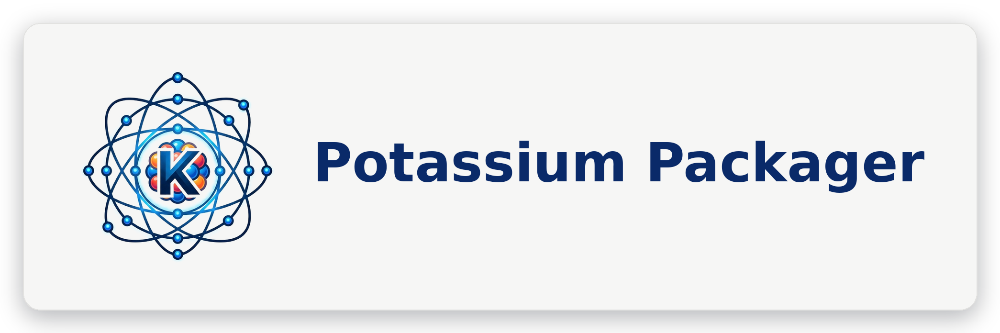

<p align="center">
  
</p>

# Potassium

[](https://central.sonatype.com/artifact/com.seanproctor/potassium-packager)
[](https://central.sonatype.com/artifact/com.seanproctor/potassium-updater)
[](https://github.com/sproctor/potassium/blob/main/LICENSE)


**Potassium packages, distributes, and auto-updates Compose / JVM desktop applications** on macOS, Windows, and Linux. It ships two artifacts from one repo:

- **`potassium-packager`** ([`plugin/`](plugin/)) — a Gradle plugin that builds installers, signs/notarizes, and generates auto-update metadata. It is a drop-in extension of the official JetBrains Compose Desktop plugin: keep your existing `compose.desktop` configuration and add the capabilities you need.
- **`potassium-updater`** ([`updater/`](updater/)) — a standalone runtime library that self-updates an installed app from the manifests the plugin produces.

## What it does

- **Many installer formats** — Linux `deb` / `rpm` / `AppImage` / `snap` / `flatpak`, Windows `msi` / `exe` (NSIS) / `appx`, macOS `dmg` / `pkg`, plus archives (`zip`, `tar`, `7z`)
- **Store-ready builds** — Mac App Store, Microsoft Store, Snapcraft, Flathub
- **Code signing & notarization** — Windows (PFX / Azure) and macOS, built into the build pipeline
- **Auto-update** — electron-builder-based update metadata (`latest-*.yml`) generated alongside your installers, with SHA-512 verification
- **GraalVM Native Image** — standalone native binaries with automatic reachability-metadata resolution (no manual reflection config for most apps)
- **Deep links & file associations** — protocol handlers and file type registration on all platforms
- **AOT cache, ProGuard, trusted CA certificates**, and more — all opt-in via the DSL

## Quick Start

```kotlin
// settings.gradle.kts
pluginManagement {
    repositories {
        gradlePluginPortal()
        mavenCentral()
    }
}
```

```kotlin
// build.gradle.kts
plugins {
    kotlin("jvm") version "..."
    id("org.jetbrains.kotlin.plugin.compose") version "..."
    id("org.jetbrains.compose") version "..."
    id("com.seanproctor.potassium") version "0.3.0"
}

potassium {
    mainClass = "com.example.MainKt"
    packageName = "MyApp"
    packageVersion = "1.0.0"

    macOS { targetFormats(MacOSTargetFormat.Dmg) }
    windows { targetFormats(WindowsTargetFormat.Nsis) }
    linux { targetFormats(LinuxTargetFormat.Deb) }
}
```

```bash
./gradlew run                              # Run locally
./gradlew packageDistributionForCurrentOS  # Build installers for the current OS
```

> Kotlin DSL types live under `com.seanproctor.potassium.*` (for example
> `import com.seanproctor.potassium.dsl.MacOSTargetFormat`).

## Documentation

Full documentation — configuration reference, per-platform targets, code signing, auto-update, GraalVM, and CI/CD — is in the [`docs/`](docs/) directory and published at the project site.

A good starting point is [Getting Started](docs/getting-started.md), followed by [Configuration](docs/configuration.md) and [Migration from org.jetbrains.compose](docs/migration.md).

## Sample

[`sample/`](sample/) is a runnable Compose Multiplatform desktop app packaged by this plugin. It's a
composite build that uses the plugin from source, so `cd sample && ./gradlew run` (or
`packageDistributionForCurrentOS`) works against your local checkout. See [`sample/README.md`](sample/README.md).

## Updater

[`updater/`](updater/) is the `potassium-updater` runtime library — a small, dependency-light
companion that self-updates an installed desktop app from the electron-builder-style
`latest-*.yml` manifests the plugin generates. It detects how the app was installed at runtime,
picks the matching artifact, verifies its SHA-512, and runs the platform-appropriate installer.
Add it to your app's runtime classpath:

```kotlin
dependencies {
    implementation("com.seanproctor:potassium-updater:0.3.0")
}
```

See [`updater/README.md`](updater/README.md) and the [Auto Update](docs/auto-update.md) guide.

## Coordinates

- **Plugin id:** `com.seanproctor.potassium` (artifact `com.seanproctor:potassium-packager`)
- **Updater library:** `com.seanproctor:potassium-updater`
- **Latest version:** `0.3.0`
- **Published to:** Maven Central
- **Repository:** https://github.com/sproctor/potassium

## Requirements

| Requirement | Version | Note |
|-------------|---------|------|
| JDK | 17+ (25+ for AOT cache) | |
| Gradle | 8.0+ | |
| Kotlin | 2.0+ | |
| Node.js | 18+ | Required by electron-builder for installer formats |

## License

MIT — See [LICENSE](LICENSE).
</content>
</invoke>
