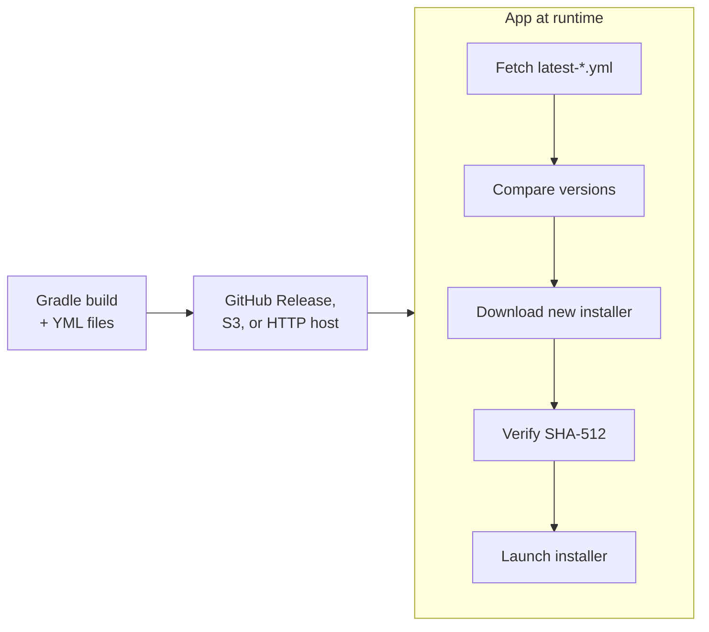

# Auto Update

Potassium provides a complete auto-update solution compatible with the [electron-builder update format](https://www.electron.build/auto-update). The system has two parts:

1. **Build-time**: electron-builder writes a single update metadata file (`latest-<os>.yml`) alongside your installers, and uploads it together with the installers to whichever provider you configure (GitHub, S3, or generic)
2. **Runtime**: The `potassium.updater-runtime` library checks for updates, downloads, and installs them

## How It Works



!!! tip "Try it yourself"
    Download an **older version** of the [potassium-sample](https://github.com/sproctor/potassium-sample) app from its [releases page](https://github.com/sproctor/potassium-sample/releases), install it, and launch it. The app will automatically detect that a newer version is available, download the update with a progress bar, and offer an "Install & Restart" button. This is the exact same flow your users will experience.

## Updatable Formats

| Platform | Updatable Formats | Not auto-updated |
|----------|-------------------|------------------|
| macOS | DMG, ZIP | PKG |
| Windows | EXE/NSIS, NSIS Web | MSI, AppX/MSIX, Portable |
| Linux | DEB, RPM, AppImage | Snap, Flatpak |

PKG (macOS), AppX/MSIX (Windows), Snap, and Flatpak are not supported by the auto-updater because Potassium assumes these formats are distributed through their respective app stores (Mac App Store, Microsoft Store, Snapcraft, Flathub), which handle updates natively.

!!! note "MSI installs are treated as managed deployments"
    An MSI install reports `isUpdateSupported() == false`, so the app never applies the NSIS installer over it. electron-builder publishes no `.msi` entries in `latest.yml`, and per-machine MSI upgrades require UAC elevation, so MSI is best suited for IT-managed distribution (Intune, Group Policy, SCCM) where updates are pushed centrally. To opt in to MSI self-update anyway, set `executableType = InstallType.MSI` in the updater config and serve a custom update manifest that lists the `.msi` artifact — the updater then applies it with `msiexec /i <file> /passive`. Set it only on Windows: a shared configuration that sets it unconditionally throws `IllegalArgumentException` when the app starts on macOS or Linux, where no manifest can ever list an `.msi`.

The install format is detected at runtime:

- **Linux** — the `APPIMAGE`/`SNAP`/`FLATPAK` environment variables, and the `resources/package-type` marker electron-builder writes for deb/rpm.
- **Windows** — the `resources/package-type` marker the packager stamps for MSI (see below), the `PORTABLE_EXECUTABLE_FILE` environment variable (portable), or a `WindowsApps` install path (AppX/MSIX). Anything else is NSIS, the only remaining installed format the updater applies.

Nothing is inferred from what an install *lacks*: MSI was the only format that needed such an inference, and it now identifies itself. Installs produced before the marker existed carry none, so an MSI from an older build still resolves to NSIS.

!!! info "MSI builds in its own electron-builder invocation"
    Because `--prepackaged` feeds one directory to every target in an invocation, a marker written for the batched Windows build would stamp NSIS and portable identically. MSI is therefore packaged on its own so its app image can carry `resources/package-type = msi` — the one thing that distinguishes an MSI install at runtime, since the installed payload is otherwise identical to the NSIS one.

    Two consequences: requesting MSI adds a second electron-builder invocation to the Windows build, and the `.msi` is written to its own `msi/` output directory rather than alongside the other Windows artifacts. Publishing workflows that glob the Windows output directory need to pick up both.

!!! warning "macOS: ZIP is required alongside DMG"
    On macOS, the auto-updater uses the **ZIP** format to perform the update (extract and replace the `.app` bundle silently). The DMG is used for initial installation only. You **must** include `MacOSTargetFormat.Zip` in your macOS `targetFormats` configuration, otherwise macOS auto-update will not work:

    ```kotlin
    macOS {
        targetFormats(
            MacOSTargetFormat.Dmg,   // Initial install
            MacOSTargetFormat.Zip,   // Required for auto-update on macOS
            // ... other formats
        )
    }
    ```

    Both the DMG and ZIP artifacts must be uploaded to the same release (GitHub, S3, or HTTP server). The generated `latest-mac.yml` will reference both files.

## Differential (Delta) Updates

The updater downloads updates **differentially** whenever it can: instead of fetching the whole installer, it compares electron-builder *blockmaps* (content-defined chunk indexes) of the old and new artifacts and downloads only the changed chunks via HTTP range requests. For a typical release that changes a small part of the app, this cuts the transfer to a fraction of the full size.

| Platform | Format | Old file used for diffing | Blockmap location |
|----------|--------|---------------------------|-------------------|
| Linux | AppImage | The running AppImage (`$APPIMAGE`) | Embedded in the AppImage tail |
| macOS | ZIP | Previous download, cached by the updater | `<artifact>.zip.blockmap` sidecar |
| Windows | EXE/NSIS, NSIS Web | Previous download, or the installer copy the NSIS install itself seeds | `<artifact>.exe.blockmap` sidecar |

NSIS Web installs are included because they update via the full NSIS installer, which has a blockmap. Everything else (DEB, RPM, MSI) always downloads in full — electron-builder produces no blockmaps for those formats.

How it behaves:

- **Fully automatic with graceful fallback.** Any problem — a missing `.blockmap` on the server, a host without HTTP `Range` support, a checksum mismatch, a missing cached old file — silently falls back to a full download. Differential downloading is purely an optimization; integrity always comes from the whole-file SHA-512 check, which runs on every download either way.
- **AppImage works immediately**: the old file is the running AppImage itself and its blockmap is embedded in it, so even the first update after install is differential.
- **Windows works immediately too (when installed via the NSIS installer)**: electron-builder's NSIS installer copies itself to `%LOCALAPPDATA%\<app>-updater\installer.exe` at install time, and the updater diffs against that copy when its own cache is empty — so the *first* update on a machine is already differential. This path fetches the old release's `.blockmap` from the server, so it needs the previous release still hosted and a versioned artifact name (the defaults). Installs whose seed copy is missing (e.g. per-machine installs run by a different user) simply fall back to a full first download.
- **macOS needs one prior download**: the updater keeps the last downloaded artifact (plus its blockmap) in an `update-cache/` directory inside the per-app data directory (`%APPDATA%/<appId>`, `~/Library/Application Support/<appId>`, or `$XDG_DATA_HOME/<appId>`) — on Windows this cache also takes over from the seeded installer after the first update. The *first* macOS update after a fresh install is a full download (the original ZIP's bytes don't exist on disk after a DMG install); subsequent ones are differential. The cache holds a single artifact (roughly the size of your installer); disabling differential downloads disables the cache and clears any previously stored artifact on the next update.
- **Progress reflects actual transfer**: during a differential download, `DownloadProgress.totalBytes` is the number of bytes being downloaded, not the full artifact size. If the differential attempt fails midway, progress restarts against the full size.
- **Hosting requirements**: publish the `.blockmap` files next to your installers (electron-builder and the reference CI pipeline already emit and upload them), and serve artifacts from a host that supports HTTP range requests (GitHub Releases, S3, and standard static file servers all do). Keeping the previous release's files online lets the updater re-fetch the old blockmap when its local cache is missing.

Opting out:

```kotlin
PotassiumUpdater {
    // ...
    disableDifferentialDownload = true  // always download full installers
}
```

## Update Metadata (YML Files)

The auto-updater relies on the `latest-*.yml` manifests electron-builder writes next to each installer — each lists the available files with their SHA-512 checksums and sizes. Because a Compose/JVM app can't cross-compile its bundled runtime image, every architecture is built on its own machine, so producing the final manifests is partly a matter of **combining per-arch outputs**.

### How CI generates them

Each build runs electron-builder in a single invocation, so electron-builder writes the manifest (`latest-mac.yml`, `latest.yml` on Windows, `latest-linux.yml` / `latest-linux-arm64.yml`) alongside the installers it produces — checksums and sizes already filled in. CI then collects and publishes them:

1. Each `(os, arch)` builds its installers in parallel and uploads them — together with its `latest-*.yml` — as separate artifacts (`release-assets-macOS-arm64`, `release-assets-Linux-amd64`, etc.)
2. A final `release` job downloads all artifacts into a single directory
3. The `publish-github-release` action consolidates the per-arch manifests and uploads everything to the release

How those manifests combine depends on the OS, because electron-updater fetches a different filename per platform:

- **Linux** — already per-arch: `latest-linux.yml` (x64) and `latest-linux-arm64.yml` (arm64). Nothing to merge.
- **Windows** — both arches share `latest.yml`, so `publish-github-release` unions their `files:` arrays into one.
- **macOS** — both arches share `latest-mac.yml`. Ship a **universal** binary (one manifest, via `build-macos-universal`) or **per-arch** packages (the two manifests get merged like Windows).

See [Multi-architecture update manifests](ci-cd.md#multi-architecture-update-manifests) for the full mechanics and a complete reference release pipeline.

### Building locally

Each build is packaged in a single electron-builder invocation, so electron-builder writes the `latest-<os>.yml` for that build alongside the installers when you run `packageDistributionForCurrentOS`, and — for github, s3, and generic alike — uploads it as part of publishing. A single-arch build on one machine is ready to use as-is; combining architectures into one release is what CI's publish step automates.

!!! tip
    In practice, always use CI for multi-platform releases. The [release workflow](https://github.com/sproctor/potassium/blob/main/.github/workflows/release-desktop.yaml) handles all of this automatically: build on each platform in parallel and publish to GitHub Releases in a single pipeline.

### YML file examples

electron-builder generates one manifest per platform (plus a `-arm64` variant for non-x64 Linux):

### `latest-mac.yml`
```yaml
version: 1.2.3
files:
  - url: MyApp-1.2.3-macos-arm64.dmg
    sha512: VkJl1gDqcBHYbYhMb0HRI...
    size: 102400000
  - url: MyApp-1.2.3-macos-amd64.dmg
    sha512: qJ8a5gFDCwv0R2rW6lM3k...
    size: 98765432
releaseDate: '2025-06-15T10:30:00.000Z'
```

### `latest.yml` (Windows)
```yaml
version: 1.2.3
files:
  - url: MyApp-1.2.3-windows-amd64-nsis.exe
    sha512: abc123...
    size: 85000000
releaseDate: '2025-06-15T10:30:00.000Z'
```

### `latest-linux.yml`
```yaml
version: 1.2.3
files:
  - url: MyApp-1.2.3-linux-amd64.deb
    sha512: def456...
    size: 68000000
  - url: MyApp-1.2.3-linux-arm64.deb
    sha512: ghi789...
    size: 65000000
releaseDate: '2025-06-15T10:30:00.000Z'
```

## Release Channels

Potassium supports three release channels. Different YML files are generated for each:

| Channel | YML Files | Tag Pattern |
|---------|-----------|-------------|
| `latest` | `latest-*.yml` | `v1.0.0` |
| `beta` | `beta-*.yml` | `v1.0.0-beta.1` |
| `alpha` | `alpha-*.yml` | `v1.0.0-alpha.1` |

The channel is auto-detected in two places from the same SemVer pre-release identifier:

- **At build time**, CI picks the channel from the version tag to name the generated YML files.
- **At runtime**, the updater picks the channel from `currentVersion` when `channel` is left `null`
  (a version containing `alpha`/`beta` tracks that channel, otherwise `latest`) — see
  [Configuration](#configuration).

## Publishing Artifacts

### The `publish {}` block in `build.gradle.kts`

The `publish {}` block **only generates configuration** for electron-builder — it does **not** upload anything by itself. It tells the generated `electron-builder.yml` where the update files will be hosted, so the updater knows where to look:

```kotlin
potassium {
    publish {
        github {
            enabled = true
            owner = "myorg"
            repo = "myapp"
            channel = ReleaseChannel.Latest
            releaseType = ReleaseType.Release
        }
    }
}
```

You are responsible for uploading the installers and YML files to your chosen hosting. There are three options:

### Option 1: GitHub Releases (recommended)

The simplest approach. Follow the [reference release pipeline](ci-cd.md) which handles everything:

1. Builds on all platforms in parallel
2. Generates the `latest-*.yml` files from all platform artifacts
3. Uploads everything to a GitHub Release

Push a tag (`v1.0.0`) and the workflow takes care of the rest. See [CI/CD](ci-cd.md) for setup details and [Publishing](publishing.md) for the full DSL reference.

### Option 2: Amazon S3

Configure the S3 provider and upload artifacts from your CI pipeline:

```kotlin
publish {
    s3 {
        enabled = true
        bucket = "my-updates-bucket"
        region = "us-east-1"
        path = "releases"
        acl = "public-read"
    }
}
```

### Option 3: Generic HTTP server

Host your files on any HTTP server. Upload the installers and YML files to the same base URL:

```kotlin
publish {
    generic {
        enabled = true
        url = "https://updates.example.com/releases/"
    }
}
```

The updater will fetch `https://updates.example.com/releases/latest-mac.yml` (and equivalent for other platforms) to check for updates, then download the installer from the same base URL.

See [Publishing](publishing.md) for the full configuration reference.

## Runtime Library

### Installation

```kotlin
dependencies {
    implementation("com.seanproctor:potassium-updater:0.4.0")
}
```

### Quick Start

```kotlin
import com.seanproctor.potassium.updater.PotassiumUpdater
import com.seanproctor.potassium.updater.UpdateResult
import com.seanproctor.potassium.updater.provider.GitHubProvider

val updater = PotassiumUpdater {
    provider = GitHubProvider(owner = "myorg", repo = "myapp")
}

when (val result = updater.checkForUpdates()) {
    is UpdateResult.Available -> {
        println("Update available: ${result.info.version}")

        updater.downloadUpdate(result.info).collect { progress ->
            println("${progress.percent.toInt()}%")
            if (progress.file != null) {
                updater.installAndRestart(progress.file!!)
            }
        }
    }
    is UpdateResult.NotAvailable -> println("Up to date")
    is UpdateResult.Error -> println("Error: ${result.exception.message}")
}
```

### Configuration

```kotlin
PotassiumUpdater {
    // Current app version (auto-detected from the `app.version` system property that
    // Potassium injects, falling back to `jpackage.app-version`)
    currentVersion = "1.0.0"

    // Update source (required)
    provider = GitHubProvider(owner = "myorg", repo = "myapp")

    // Release channel. Leave null (the default) to auto-detect from currentVersion:
    // "alpha" if it contains "alpha", "beta" if it contains "beta", otherwise "latest".
    // Set it explicitly to pin a channel.
    channel = null

    // Allow installing older versions
    allowDowngrade = false

    // Force a specific installer format (auto-detected if null). Setting this is also the
    // opt-in for MSI self-update, which is never applied on detection alone.
    // Must be a format that can exist on the running platform — constructing the updater with,
    // say, InstallType.MSI on macOS throws IllegalArgumentException. In a cross-platform app,
    // set it per platform rather than in shared code.
    executableType = null

    // Disable blockmap-based differential downloads (see "Differential (Delta) Updates");
    // every update is then downloaded in full and no artifact cache is kept.
    disableDifferentialDownload = false
}
```

Because the channel defaults to `null` and is derived from `currentVersion`, an app built from a
`1.2.3-beta.1` tag automatically tracks the `beta` channel, while a `1.2.3` release tracks `latest` —
no extra configuration needed. Pin `channel` explicitly only when you want a build to follow a
channel that doesn't match its own version.

### Providers

#### GitHub Releases

```kotlin
import com.seanproctor.potassium.updater.provider.GitHubProvider

provider = GitHubProvider(
    owner = "myorg",
    repo = "myapp",
    token = "ghp_..."  // Optional, for private repos
)
```

#### Generic HTTP Server

```kotlin
import com.seanproctor.potassium.updater.provider.GenericProvider

provider = GenericProvider(
    baseUrl = "https://updates.example.com"
)
```

Host your YML files, installers, and blockmaps at:
```
https://updates.example.com/latest-mac.yml          # macOS (both arches)
https://updates.example.com/latest.yml               # Windows (both arches)
https://updates.example.com/latest-linux.yml         # Linux x64
https://updates.example.com/latest-linux-arm64.yml   # Linux arm64
https://updates.example.com/MyApp-1.2.3-macos-universal.dmg
https://updates.example.com/MyApp-1.2.3-macos-universal.zip
https://updates.example.com/MyApp-1.2.3-macos-universal.zip.blockmap   # differential updates
https://updates.example.com/MyApp-1.2.3-linux-arm64.AppImage
```

The server must support HTTP `Range` requests for differential downloads (any standard static file server does); without them the updater simply downloads full installers.

### API Reference

#### PotassiumUpdater

| Member | Description |
|--------|-------------|
| `val currentVersion: String` | The currently installed version the updater compares against |
| `val channel: String` | The effective release channel — the configured `channel`, or auto-detected from `currentVersion` when it is `null` |
| `isUpdateSupported(): Boolean` | Check if the current executable type supports auto-update |
| `suspend checkForUpdates(): UpdateResult` | Check for a newer version |
| `downloadUpdate(info: UpdateInfo): Flow<DownloadProgress>` | Download the installer with progress |
| `installAndRestart(installerFile: File)` | Launch the installer, exit the current process, and relaunch after install |
| `installAndQuit(installerFile: File)` | Launch the installer and exit without relaunching — the update is applied on next manual start |
| `consumeUpdateEvent(): UpdateEvent?` | Returns the post-update event if the app was just updated, then clears it. Returns `null` if no update occurred. |
| `wasJustUpdated(): Boolean` | Non-consuming check — returns `true` if the app was launched after an update. Call `consumeUpdateEvent()` to clear. |

#### DownloadProgress

```kotlin
data class DownloadProgress(
    val bytesDownloaded: Long,
    val totalBytes: Long,
    val percent: Double,       // 0.0 .. 100.0
    val file: File? = null,    // Non-null on the final emission
)
```

#### UpdateResult

```kotlin
sealed class UpdateResult {
    data class Available(val info: UpdateInfo, val level: UpdateLevel)
    data object NotAvailable
    data class Error(val exception: UpdateException)
}
```

#### UpdateLevel

```kotlin
enum class UpdateLevel {
    MAJOR,       // e.g. 1.x.x → 2.x.x
    MINOR,       // e.g. 1.2.x → 1.3.x
    PATCH,       // e.g. 1.2.3 → 1.2.4
    PRE_RELEASE, // e.g. 1.2.3-beta.1 → 1.2.3-beta.2
}
```

The `level` is computed automatically by comparing the current version with the available version using semantic versioning.

#### UpdateEvent

```kotlin
data class UpdateEvent(
    val previousVersion: String,
    val newVersion: String,
    val updateLevel: UpdateLevel,
)
```

### Compose Desktop Integration

```kotlin
@Composable
fun UpdateBanner() {
    val updater = remember {
        PotassiumUpdater {
            provider = GitHubProvider(owner = "myorg", repo = "myapp")
        }
    }

    var status by remember { mutableStateOf("Checking for updates...") }
    var progress by remember { mutableStateOf(-1.0) }
    var downloadedFile by remember { mutableStateOf<File?>(null) }

    LaunchedEffect(Unit) {
        when (val result = updater.checkForUpdates()) {
            is UpdateResult.Available -> {
                status = "Downloading v${result.info.version}..."
                updater.downloadUpdate(result.info).collect {
                    progress = it.percent
                    if (it.file != null) {
                        downloadedFile = it.file
                        status = "Ready to install v${result.info.version}"
                    }
                }
            }
            is UpdateResult.NotAvailable -> status = "Up to date"
            is UpdateResult.Error -> status = "Error: ${result.exception.message}"
        }
    }

    Column {
        Text(status)
        if (progress in 0.0..99.9) {
            LinearProgressIndicator(progress = (progress / 100.0).toFloat())
        }
        downloadedFile?.let { file ->
            Button(onClick = { updater.installAndRestart(file) }) {
                Text("Install & Restart")
            }
        }
    }
}
```

### Installer Behavior

The `installAndRestart()` method launches the platform-specific installer, exits the current process, and relaunches the app after installation:

| Platform | Format | Command |
|----------|--------|---------|
| Linux | DEB | `sudo dpkg -i <file>` |
| Linux | RPM | `sudo rpm -U <file>` |
| macOS | DMG/PKG | `open <file>` |
| Windows | EXE/NSIS | `<file> /S --updated` (silent; the updater relaunches the app afterwards) |
| Windows | MSI (opt-in) | `msiexec /i <file> /passive` |

On every platform the app is relaunched by the updater itself with no arguments — the relaunched process never receives installer-protocol flags.

### Silent Update with `installAndQuit()`

The `installAndQuit()` method works like `installAndRestart()` but does **not** relaunch the application after installation. The update is applied silently in the background and takes effect the next time the user opens the app. This is useful for applying updates transparently (e.g. when the user closes the app).

```kotlin
// Example: apply update silently on app close
updater.downloadUpdate(result.info).collect { progress ->
    if (progress.file != null) {
        updater.installAndQuit(progress.file!!)
    }
}
```

#### Platform considerations

| Platform | Format | Silent? | Notes |
|----------|--------|---------|-------|
| macOS | DMG | Yes | Installed via `open`, no elevation needed |
| macOS | ZIP | Yes | Extracted silently, no elevation needed |
| Windows | NSIS/EXE | Depends | Silent if installed in **user mode**; requires UAC elevation if installed system-wide |
| Windows | MSI | Depends | Silent if installed in **user mode**; requires UAC elevation if installed system-wide |
| Linux | AppImage | Yes | Replaces the file in place, no elevation needed |
| Linux | DEB | No | Always requires elevation (`pkexec`) |
| Linux | RPM | No | Always requires elevation (`pkexec`) |

### Using a Native HTTP Client

By default, the updater uses a plain `java.net.http.HttpClient` backed by the JDK trust store. On machines with **enterprise proxies**, **corporate CAs**, or **user-installed certificates**, HTTPS requests may fail with `SSLHandshakeException`.

To fix this, pass a client pre-configured with the OS trust store (for example via `NativeTrustManager`):

**1. Add the dependency**

```kotlin
dependencies {
    implementation("com.seanproctor:potassium-updater:0.4.0")
    // Upstream Nucleus runtime library — deliberately keeps its original coordinates.
    implementation("io.github.kdroidfilter:nucleus.native-http:<version>")
}
```

**2. Inject the client in the updater config**

```kotlin
import io.github.kdroidfilter.nucleus.nativehttp.NativeHttpClient
import com.seanproctor.potassium.updater.PotassiumUpdater
import com.seanproctor.potassium.updater.provider.GitHubProvider

val updater = PotassiumUpdater {
    provider = GitHubProvider(owner = "myorg", repo = "myapp")
    httpClient = NativeHttpClient.create()
}
```

The injected client is used for **both** the metadata check and the file download.

You can also compose additional options via the builder extension:

```kotlin
import io.github.kdroidfilter.nucleus.nativehttp.NativeHttpClient.withNativeSsl
import java.net.http.HttpClient
import java.time.Duration

val updater = PotassiumUpdater {
    provider = GitHubProvider(owner = "myorg", repo = "myapp")
    httpClient = HttpClient.newBuilder()
        .withNativeSsl()
        .connectTimeout(Duration.ofSeconds(30))
        .followRedirects(HttpClient.Redirect.NORMAL)
        .build()
}
```

### Update Level

When `checkForUpdates()` returns `UpdateResult.Available`, the `level` field tells you how significant the update is:

```kotlin
when (val result = updater.checkForUpdates()) {
    is UpdateResult.Available -> {
        when (result.level) {
            UpdateLevel.MAJOR -> showMajorUpdateDialog(result.info)
            UpdateLevel.MINOR -> showMinorUpdateBanner(result.info)
            UpdateLevel.PATCH -> silentlyDownloadAndInstall(result.info)
            UpdateLevel.PRE_RELEASE -> showPreReleaseBanner(result.info)
        }
    }
    // ...
}
```

This allows you to adapt the UI — for example, force a confirmation dialog for major updates while silently applying patches.

### Post-Update Detection

After an update is installed (via `installAndRestart()` or `installAndQuit()`), the updater persists a marker file. On the next launch, you can detect that the app was just updated:

The marker is validated against the running app: if the app still reports the version that was current when the marker was written, the update has not taken effect — the install failed, or it is still running and the user reopened the old app — and no update event is reported. The marker itself is kept, so an install still in flight is reported correctly once it completes; only `consumeUpdateEvent()` clears it, and only when it actually returns an event.

Neither `wasJustUpdated()` nor `consumeUpdateEvent()` throws. A marker that cannot be read or parsed (for example a torn write from a crash mid-update) is reported as "not updated" rather than propagating an exception into your startup path.

```kotlin
val updater = PotassiumUpdater {
    provider = GitHubProvider(owner = "myorg", repo = "myapp")
}

// Quick non-consuming check
if (updater.wasJustUpdated()) {
    println("App was just updated!")
}

// Consume the event (returns null on subsequent calls)
val event = updater.consumeUpdateEvent()
if (event != null) {
    println("Updated from ${event.previousVersion} to ${event.newVersion}")
    println("This was a ${event.updateLevel} update")
    showWhatsNewDialog(event)
}
```

#### Compose Integration

```kotlin
@Composable
fun PostUpdateBanner(updater: PotassiumUpdater) {
    var updateEvent by remember { mutableStateOf(updater.consumeUpdateEvent()) }

    updateEvent?.let { event ->
        Card(modifier = Modifier.fillMaxWidth().padding(16.dp)) {
            Row(
                modifier = Modifier.padding(16.dp),
                verticalAlignment = Alignment.CenterVertically,
            ) {
                Column(modifier = Modifier.weight(1f)) {
                    Text("Updated to v${event.newVersion}")
                    Text(
                        "${event.updateLevel} update from v${event.previousVersion}",
                        style = MaterialTheme.typography.bodySmall,
                    )
                }
                TextButton(onClick = { updateEvent = null }) {
                    Text("Dismiss")
                }
            }
        }
    }
}
```

The marker file is stored in the platform-specific app data directory (resolved from the `app.id` system property, falling back to a per-install derived id):

- **Linux**: `$XDG_DATA_HOME/<appId>/` or `~/.local/share/<appId>/`
- **macOS**: `~/Library/Application Support/<appId>/`
- **Windows**: `%APPDATA%/<appId>/`

### Security

- All downloads are verified with **SHA-512** checksums (base64-encoded)
- Differential downloads are verified against the same whole-file SHA-512 after reassembly; a mismatch discards the file and falls back to a full download
- If verification fails, the downloaded file is deleted and an error is returned
- GitHub token is transmitted via `Authorization` header (not URL params) for private repos
